## Who Am I ?

Quentin SWIECH 
- Tech Lead Cloud & DevOps @Thales
 - quentin.swiech@gmail.com
- [https://github/com/q-sw](https://github/com/q-sw)

Certifications:


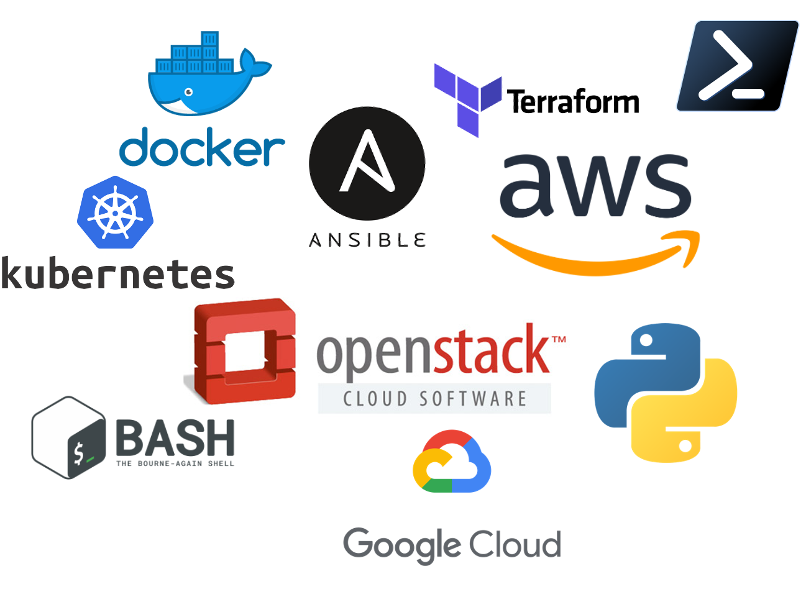

---
## Agenda

* Introduction générale - Histoire et évolution de l'informatique
* La Philosophie DevOps
* L'outillage DevOps

---

# Introduction Générale
## Histoire et évolution de l'informatique


<!-- _class: lead -->

---
## L'informatique en entreprise dans le temps
</br>

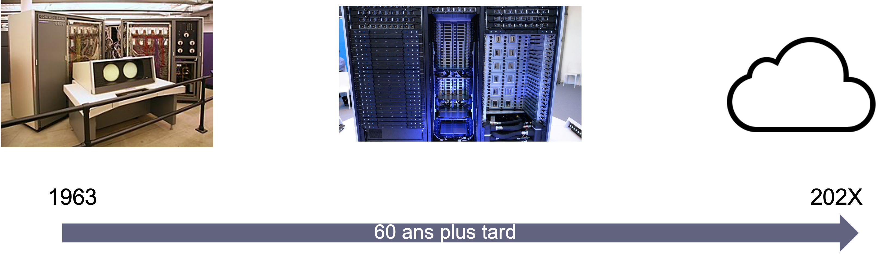

---
## L'évolution des architectures
</br>

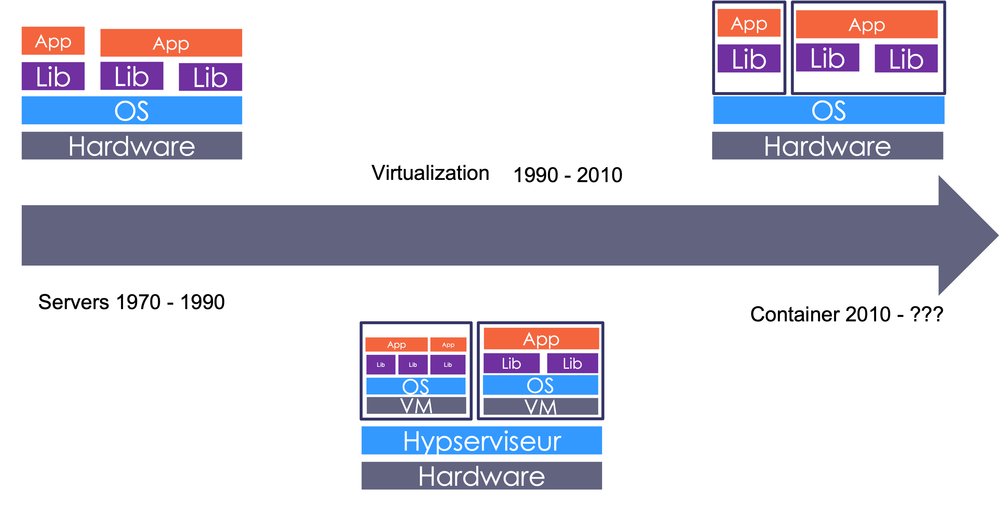

---
## L'évolution des systèmes
</br>

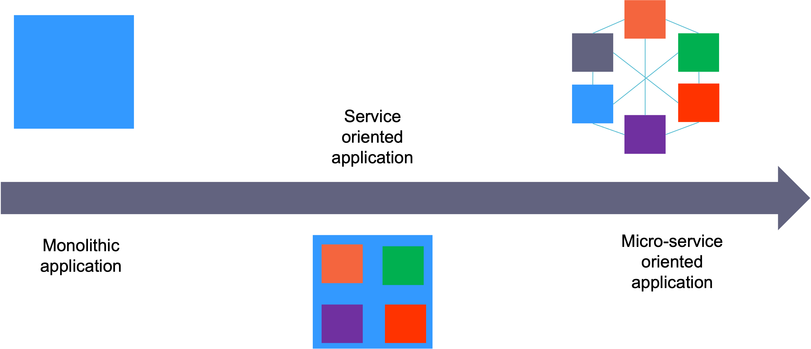

---
## L'évolution des organisations (1/3)
Les developpeurs

* Developpent et livrent les packages
* Ne sont pas impliqué dans la production
* Innovent rapidement
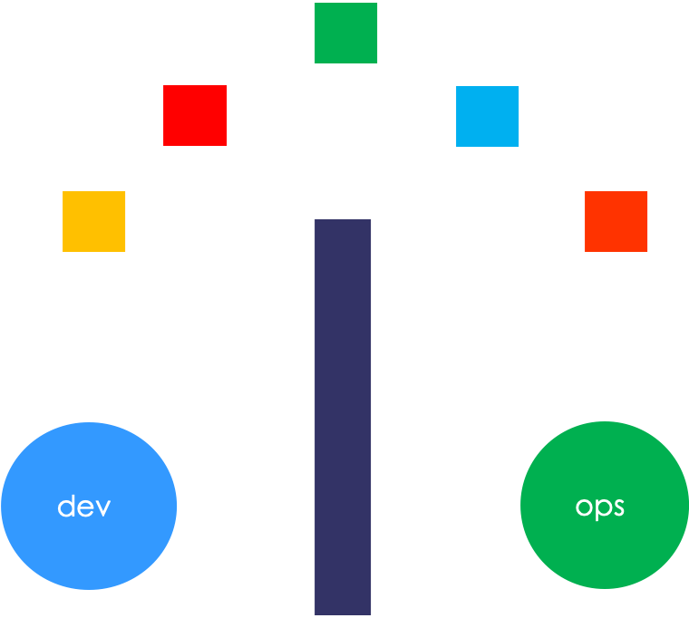

---
## L'évolution des organisations (2/3)
Les Administrateurs Systemes

* Installent, maintiennent et opérent
* Up and Running 24/7/365
* Besoin de stabilité


---
## L'évolution des organisations (3/3)
Depuis ~ 2010
Nouvelles méthodes, partiques, état d'esprit

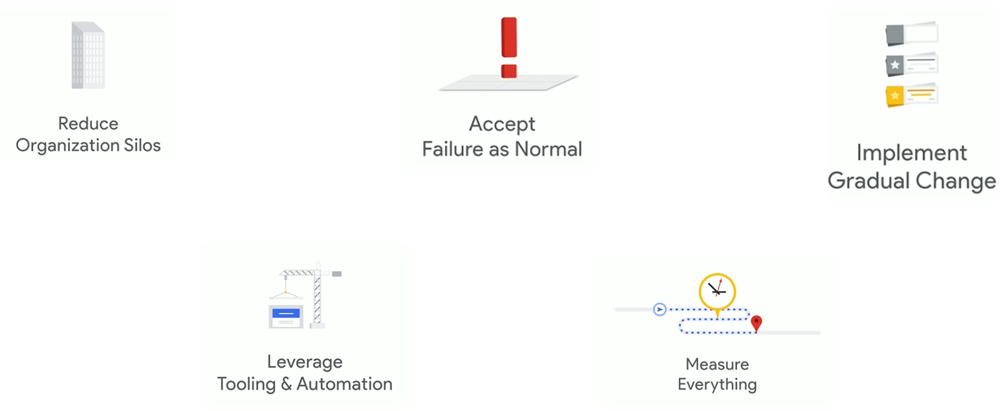

---
# LE DEVOPS
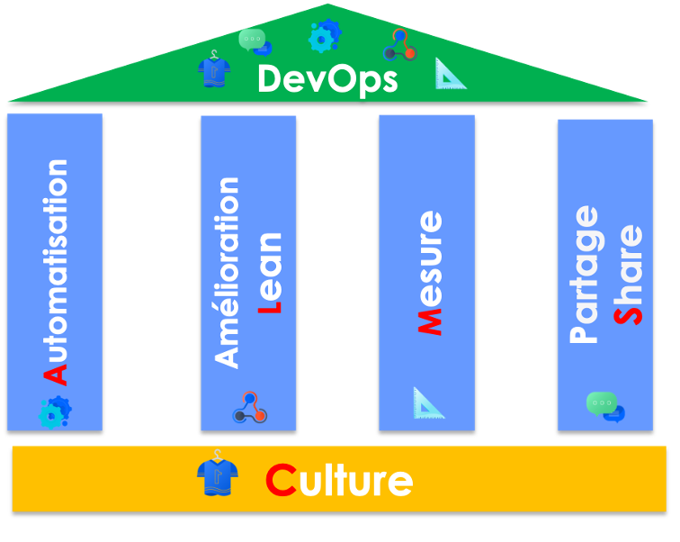
<!-- _class: lead -->

---
## Qu'est ce c'est?
> Le DevOps est un ensemble de pratiques qui visent à réduire le Time to Market et à améliorer la qualité des produits logiciels, en réinventant la coopération entre DEV et OPS

*[Octo Technologie](https://octo.com)*

---
## Les 5 Piliers du DevOps


---
## La Culture DevOps

* Rapprocher les Dev et les Ops
* Collaboration entre les personnes
* Améliorer les performances et la qualité
* Réduire les temps de mise en production - Time to Market
* Responsabilité et rendre autonome les équipes
* Agilité

---
## L'automatisation
* Infrastructure as Code - IaC
* Intégration Continue - Continuous Integration (CI)
* Livraison Continue - Continuous Delivery (CD)
* Déploiement Continue - Continuous Deployment (CD)


---
## Le Lean - L'amélioration Continue

* Tous ce que l'on fait n'est pas parfait
* Prendre du recule
* Identifier les éléments à faible valeurs ou fastideux
 
---
## Les Mesures

> You can't manage what you can't measure

*[Peter Drucker](https://fr.wikipedia.org/wiki/Peter_Drucker)*
* Mesurer pour mieux comprendre et améliorer
* KPI - Key Performance Indicator
  * Qu'est ce qu'on veut mesurer ? 
  * Pourquoi on veut mesurer ? 
  * La fréquense de mise a jour

---
## Le Partage
</br>
</br>

* Les connaissances
* Les objectifs
* Des échanges régulier 
* Retour d'expérience


---
# Comment ça se traduit en vrai ?

<!-- _class: lead -->

---
## Squad Team
- Equipe pluridisciplinaires
- Two Pizza Team 
  - 5 à 10 personnes 

*"You build it, You run it !"*
*[Werner Vogels](https://en.wikipedia.org/wiki/Werner_Vogels)*
- Rien à la main tout dans du code
- Organisation Agile


---
## Lean, Kanban

* Méthodes nées chez Toyota dans les années 50
  * Réduire les taches surperflues 
  * Réduire les couts
  * Réduire le Time to Market 
  * Amélioration Continue 


---
## Méthodes Agiles
* Méthodes définies dans l'*Agile Manifesto* en 2001
* Méthodes généralement pour le développement logiciel

* **4 valeurs principales**
  * Les individus plus que les processus et les outils
  * Du logiciel qui fonctionnes plus qu'une documentation exhaustive
  * La collaboration avec le client plus que la négociation
  * L'adaptation aux changements plus que le suivi d'un plan

---
## Composition d'une Squad
* Product / Service Owner
* Scrum Master / Team lead
* Tech Lead
* DevOps

---
## Les Rituels d'équipe (1/2)
* Stand up meeting 
  * 10 à 15 min
  * Ce que j'ai fait
  * Ce que je vais faire
  * Ce qui me bloque
* Weekly meeting
  * Bilan de la semaine

---
## Les Rituels d'équipe (2/2)
* Sprint planning
  * Définition des objectifs et taches pour les 2 à 3 prochaines semaine
  * Evaluation de la charge et de la complexité
* Retrospective
  * Bilan d'un Sprint
  * Démonstration du travail réalisé

---
# L'outillage DevOps
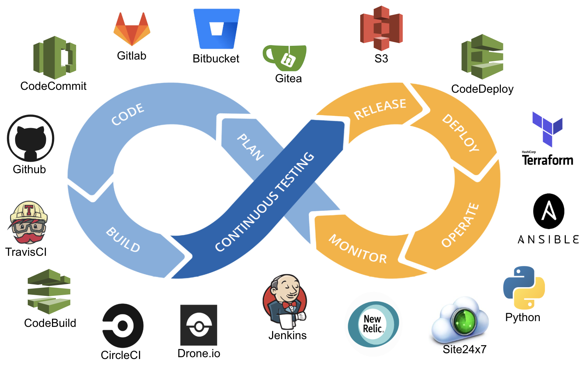
<!-- _class: lead -->
---
## Quel type d'outils? 

* Gestion de code
* Gestion d'infrastructure
* Gestion de configuration
* CI / CD
* Packaging
* Sécurité

*[img](https://mms.businesswire.com/media/20180625005106/en/664797/5/p-table-v3-1200x627.jpg?download=1)*

---
## De quoi va-t-on parler ?

<table style="margin-left: auto; margin-right: auto;">
  <tr>
    <th style="background-color: rgb(69,90,99); color: white">Type</th>
    <th style="background-color: rgb(69,90,99); color: white">Outils</th>
  </tr>
  <tr>
    <td>Gestion de code</td>
    <td>Git / GitHub /Gitlab*</td>
  </tr>
    <tr>
    <td>Gestion d'infrastructure</td>
    <td>Terraform</td>
  </tr>
    <tr>
    <td>Gestion de configuration</td>
    <td>Ansible</td>
  </tr>
    <tr>
    <td>Packaging</td>
    <td>Packer / Docker</td>
  </tr>
    <tr>
    <td>CI/CD</td>
    <td>Github Action / Gitlab CI*</td>
  </tr>
  </tr>
    <tr>
    <td>Sécurité</td>
    <td>Checkov* / Trivy*</td>
  </tr>
  
</table>

*\*si on a le temps*

---
# Gestion de Code
</br>


<!-- _class: lead -->

---
# Vous avez 30 minutes


Qu'est ce que c'est?
A quoi ça sert? 
Comment ça fonctionne? 
<!-- _class: lead -->
---
## Qu'est ce que GIT ?
- Source Code Manager (SCM)
- Créer en 2005 par Linus Torvalds 
- Suivre les changements dans le code
- Sytème basé sur des branches


---
## Les commandes de bases (1/7)
- Créer une repository
```bash
git init
```
- Télécharger un repository distant en local
```
git clone <url du repo>
```
- Affichier l'état du repository local
```
git status
```
---
## Les commandes de bases (2/7)
- Ajouter un fichier ou un dossier dans le suivie de code
```
git add <nom du fichier> / <nom du dossier> / .
```
- Ajouter un commentaire aux changement
```
git commit -m "Mon message"
```
- Afficher les fichiers suvie
```
git ls-files
```
---
## Les commandes de bases (3/7)
- Afficher l'historique des changements
```
git log
```
```
git log --oneline
git log --oneline --revert
```
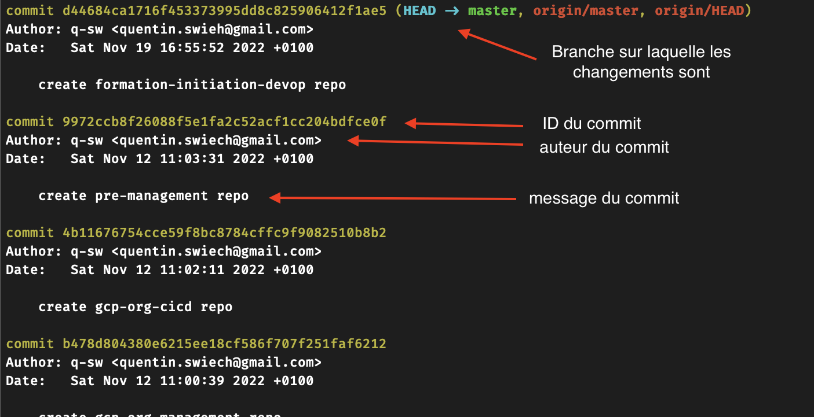

---
## Les commandes de bases (4/7)
- Afficher sa branche actuelle
```
git branch
```
- Afficher les branches disponibles
```
git branch -a
git branch -va
```
---
## Les commandes de bases (5/7)
- Créer une nouvelle branche local
```
git checkout -B <nom de la branche>
```
- Changer de branche
```
git switch <nom de la branch>
```
---
## Les commandes de bases (6/7)

- Importer les changements d'une branche à un autre
```
#branchB
git swich branchA
#branchA
git merge branchB
``` 
- Envoyer les changements sur le repository distant
```
git push
git push -u origin ma-branch
```
---
## Les commandes de bases (7/7)
- Récupérer les changements distant sans les appliquer
```
git fetch
```
- Récuperer les changements distant et les appliquer
```
git pull
```

---
## Commandes Additionnelles (1/2)

supprimer un fichier
```
git rm <file>
```
ne plus suivre un fichier
```
git rm --cache 
```
renommer un fichier
```
git mv
```
---
## Commandes Additionnelles (2/2)

Afficher les changements sur un fichier
```
git diff <file name>
```

ADD CAPUTURE AVEC EXPLICATION

---
## Git ignore
- Fichier `.gitignore`

- Indique a git les fichiers et/ou dossiers à ne pas prendre en considération

- [github.com/github/gitignore](https://github.com/github/gitignore) 
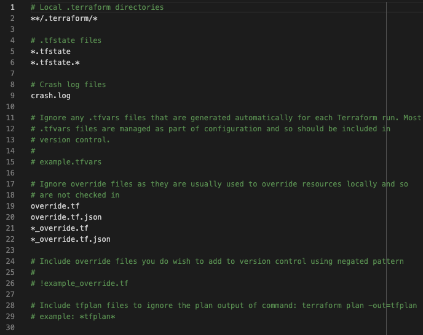

---
## Hands On (1/2)

1. Créer un dossier **DevOps** et en faire un repository GIT
2. Créer 2 branches **master** et **develop**
3. Créer un fichier README.md
4. Sur la branche **develop** créez 3 fichiers (file1, file2, file3)
5. Merge le contenu de **develop** dans **master**
6. renommer **file1** en **file1.txt**
7. supprimer **file3**

le fichier `README.md` contiendra l'ensemble des commandes

---
## Hands On (2/2)
1. Créer un compte Github
2. Créer un nouveau repository **vide**
3. Faire en sorte que le contenue du dossier **DevOps** soit dans se nouveau repository

le fichier `README.md` contiendra l'ensemble des commandes

---
# Gestion d'Infrastructure
</br>


<!-- _class: lead -->

---
# Vous avez 30 minutes


Qu'est ce que c'est?
A quoi ça sert? 
Comment ça fonctionne? 
<!-- _class: lead -->

---
## Qu'est ce que Terraform ? (1/2)
- Solution d'infrastructure as Code
- Développé en Go par Hashicorp
- Utilise le langage HCL (Hashicorp Configuratio Language)

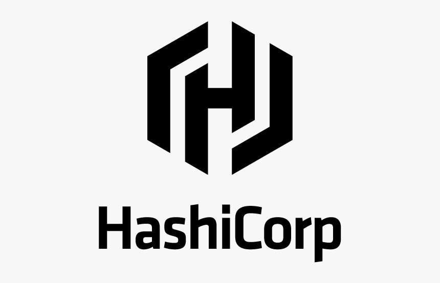

---
## Qu'est ce que Terraform ? (2/2)
- Permet de mettre en place les bonnes pratiques du développement logiciel
  - Versionning
  - Test 
  - Packaging
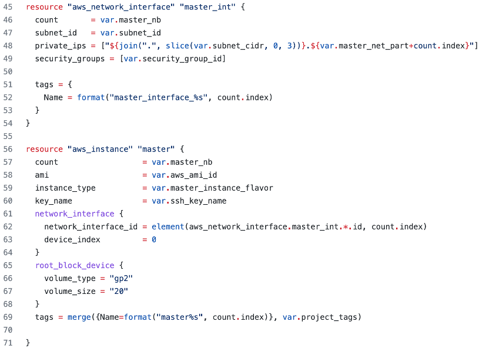

---
## Comment fonctionne Terraform ?
- Description de l'infrastructure souhaitée dans fichier *.tf
  - une ressource = un bloque de code
- Comparaison de l'infra souhaitéé avec l'infra déployée
  - Utilisation de fichier d'état (state file)
- Utilisation d'une CLI pour visualiser / appliquer / détruire les changements / infra
  - Init / Plan / Apply / Destroy
- Communique avec les APIs du solution (Provider)

---
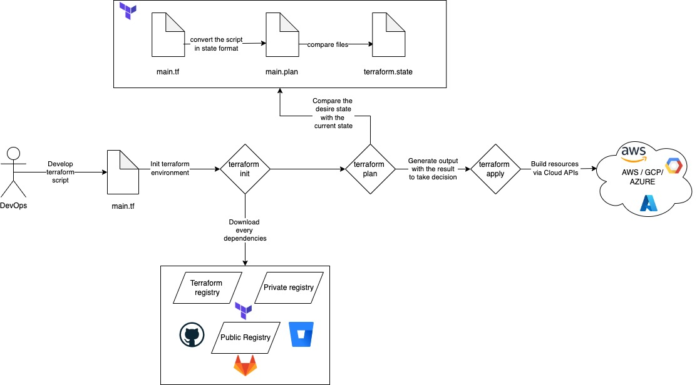

---

## Installation de Terrafrom

Windows (Chocolatey)
```
choco install terraform
```
Linux - Ubuntu
```
curl -s https://raw.githubusercontent.com/q-sw/my-tools/master/ubuntu_install_terraform.sh | sh
```
Mac OS
```
brew install terraform 
```

---
## La structure d'un projet Terraform
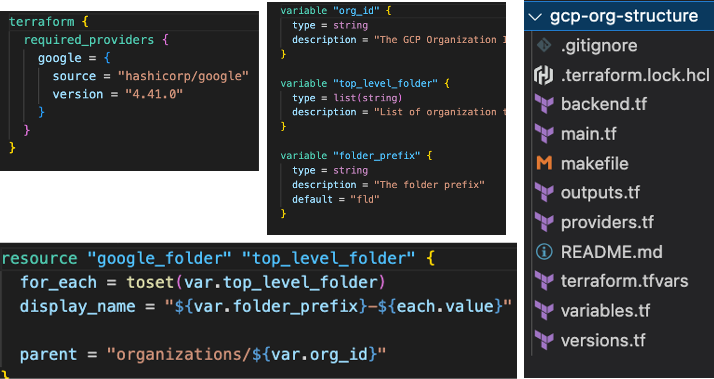


---
<h2> providers.tf </h2>

- Configuration de connexion à l'API du Cloud 

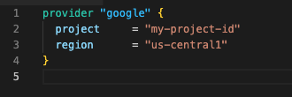

---
<h2> versions.tf </h2>

- Indique à Terraform quelles versions utiliser pour: 
  - Terraform
  - modules 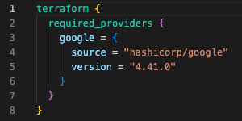
  - providers


---
<h2> backend.tf </h2>

- Fichier de configuration pour le stockage des states
- Si ce fichier n'existe pas le states seront local
- Différents backend existent
  - S3 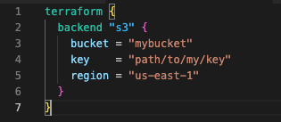
  - GCS 
  - secret kubernetes
  - PostgreSQL


---
<h2> main.tf </h2>

- Fichier de description des ressources.
 
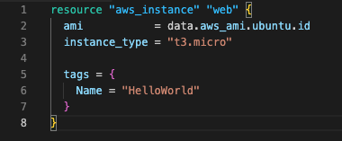

---
<h2> variables.tf (1/4) </h2>

- Fichier de définition des variables du projet
```
variable "varibale name"{
  type = string|list()|map()|object()
  description = ""
  default = ""
}
```
---

<h2> variables.tf - Les types simple (2/4) </h2>


<table style="margin-left: auto; margin-right: auto;">
  <tr>
    <th style="background-color: rgb(69,90,99); color: white">Type</th>
    <th style="background-color: rgb(69,90,99); color: white">Description</th>
    <th style="background-color: rgb(69,90,99); color: white">exemple</th>
  </tr>
  <tr>
    <td>string</td>
    <td>chaine de caractères simple</td>
    <td><code>variable "name"{</br>
              &nbsp;type = string </br>
              &nbsp;description = "the user name" </br>
              &nbsp;default = "toto"
}</td>
  </tr>
  <tr>
    <td>number</td>
    <td>valeur numérique </td>
     <td><code>...</br>
     type = number<br>
     defaut = 2</td>
  </tr>
  <tr>
    <td>boolen</td>
    <td>Boolen, true ou false</td>
    <td><code>...</br>
     type = boolen<br>
     defaut = true</td>
  </tr>
</table>

---
<h2> variables.tf - Les types complexe (3/4) </h2>
<table style="margin-left: auto; margin-right: auto;">
  <tr>
    <th style="background-color: rgb(69,90,99); color: white">Type</th>
    <th style="background-color: rgb(69,90,99); color: white">Description</th>
    <th style="background-color: rgb(69,90,99); color: white">exemple</th>
  </tr>
  <tr>
    <td>list()</td>
    <td>Liste d'un autre type de variable</td>
     <td><code>list(string)</td>
  </tr>
  <tr>
    <td>map()</td>
    <td>ensemble de clé/valeur, non prédéfinie</td>
    <td><code>map()</td>
  </tr>
  <tr>
    <td>object()</td>
    <td>ensemble de clé/valeur, prédéfinie </td>
    <td>
    <code>
      object(</br>
      &nbsp;  {name: string, </br>
      &nbsp;  age: number}</br>
      ) 
    </code>
    </td>
  </tr>
</table>

---

<h2> outputs.tf </h2>

- Permet d'afficher des informations des ressources créer
- `terraform output`
```
output "Mon output"{
  value = resource_type.resource_name.resource_object
}
```

---

## Les Fonctions builtin
|fonctions| descriptions|
|---------|-------------|
|count|Permet de réaliser une boucle sur une ressource|
|element|Permet de parcourir des element d'une liste|
|length|Permet de compter le nombre d'élément dans une liste|
|lookup|Permet dans un dictionnaire de récupérer la valeur d'un clé|

*[Documentation](https://developer.hashicorp.com/terraform/language/functions)*

---
## Les modules 

- Façon de packager des scripts Terraform
- Permet de réutiliser et de standardiser le déploiement d'une infrastructure
- Peut etre dans:
  - un dossier local
  - un repository Git

---
## Hands on

---
# Gestion de Configurations
</br>


<!-- _class: lead -->

---
# Vous avez 30 minutes


Qu'est ce que c'est?
A quoi ça sert? 
Comment ça fonctionne? 
<!-- _class: lead -->

---
## Qu'est ce qu'Ansible

- Gestionnaire de configuration écrit en Python
- Utilise SSH et WinRM
- Description de configuration en YAML
- Utilise un système d'inventaire

---
## Composant de bases d'Ansible 

- Inventaire (inventory)
- Modules
- Variables
- Playbooks
- Facts
---
## Modules

---
## Inventaire Ansibles

---
## Playbook Ansible

---
## Variables

---
## Facts

---
## Playbooks Advances tips

- Condition
- Loop
- templating
- error handling

## Roles Ansible

---
## Hands on