## Who Am I ?

Quentin SWIECH 
- Tech Lead Cloud & DevOps @Thales
 - quentin.swiech@gmail.com
- [https://github/com/q-sw](https://github/com/q-sw)

Certifications:


---
## Agenda

* Introduction générale - Histoire et évolution de l'informatique
* La Philosophie DevOps
* L'outillage DevOps

---

# Introduction Générale
## Histoire et évolution de l'informatique


<!-- _class: lead -->

---
## L'informatique en entreprise dans le temps
</br>


---
## L'évolution des architectures
</br>


---
## L'évolution des systèmes
</br>


---
## L'évolution des organisations (1/3)
Les developpeurs

* Developpent et livrent les packages
* Ne sont pas impliqué dans la production
* Innovent rapidement


---
## L'évolution des organisations (2/3)
Les Administrateurs Systemes

* Installent, maintiennent et opérent
* Up and Running 24/7/365
* Besoin de stabilité


---
## L'évolution des organisations (3/3)
Depuis ~ 2010
Nouvelles méthodes, partiques, état d'esprit


---
# Le DevOps

<!-- _class: lead -->

---
# Vous avez 60 minutes

Qu'est ce que c'est?
D'ou ca vient ? 
A quoi ca sert ? 
<!-- _class: lead -->


---
## Qu'est ce c'est?
> Le DevOps est un ensemble de pratiques qui visent à réduire le Time to Market et à améliorer la qualité des produits logiciels, en réinventant la coopération entre DEV et OPS

*[Octo Technologie](https://octo.com)*

---
## Les 5 Piliers du DevOps


---
## La Culture DevOps

* Rapprocher les Dev et les Ops
* Collaboration entre les personnes
* Améliorer les performances et la qualité
* Réduire les temps de mise en production - Time to Market
* Responsabilité et rendre autonome les équipes
* Agilité

---
## L'automatisation
* Infrastructure as Code - IaC
* Intégration Continue - Continuous Integration (CI)
* Livraison Continue - Continuous Delivery (CD)
* Déploiement Continue - Continuous Deployment (CD)


---
## Le Lean - L'amélioration Continue

* Tous ce que l'on fait n'est pas parfait
* Prendre du recule
* Identifier les éléments à faible valeurs ou fastideux
 
---
## Les Mesures

> You can't manage what you can't measure

*[Peter Drucker](https://fr.wikipedia.org/wiki/Peter_Drucker)*
* Mesurer pour mieux comprendre et améliorer
* KPI - Key Performance Indicator
  * Qu'est ce qu'on veut mesurer ? 
  * Pourquoi on veut mesurer ? 
  * La fréquense de mise a jour

---
## Le Partage
</br>
</br>

* Les connaissances
* Les objectifs
* Des échanges régulier 
* Retour d'expérience


---
# Comment ça se traduit en vrai ?

<!-- _class: lead -->

---
## Squad Team
- Equipe pluridisciplinaires
- Two Pizza Team 
  - 5 à 10 personnes 

*"You build it, You run it !"*
*[Werner Vogels](https://en.wikipedia.org/wiki/Werner_Vogels)*
- Rien à la main tout dans du code
- Organisation Agile


---
## Lean, Kanban

* Méthodes nées chez Toyota dans les années 50
  * Réduire les taches surperflues 
  * Réduire les couts
  * Réduire le Time to Market 
  * Amélioration Continue 


---
## Méthodes Agiles
* Méthodes définies dans l'*Agile Manifesto* en 2001
* Méthodes généralement pour le développement logiciel

* **4 valeurs principales**
  * Les individus plus que les processus et les outils
  * Du logiciel qui fonctionnes plus qu'une documentation exhaustive
  * La collaboration avec le client plus que la négociation
  * L'adaptation aux changements plus que le suivi d'un plan

---
## Composition d'une Squad
* Product / Service Owner
* Scrum Master / Team lead
* Tech Lead
* DevOps

---
## Les Rituels d'équipe (1/2)
* Stand up meeting 
  * 10 à 15 min
  * Ce que j'ai fait
  * Ce que je vais faire
  * Ce qui me bloque
* Weekly meeting
  * Bilan de la semaine

---
## Les Rituels d'équipe (2/2)
* Sprint planning
  * Définition des objectifs et taches pour les 2 à 3 prochaines semaine
  * Evaluation de la charge et de la complexité
* Retrospective
  * Bilan d'un Sprint
  * Démonstration du travail réalisé

---
# L'outillage DevOps

<!-- _class: lead -->
---
## Quel type d'outils? 

* Gestion de code
* Gestion d'infrastructure
* Gestion de configuration
* CI / CD
* Packaging
* Sécurité

*[img](https://mms.businesswire.com/media/20180625005106/en/664797/5/p-table-v3-1200x627.jpg?download=1)*

---
## De quoi va-t-on parler ?

<table style="margin-left: auto; margin-right: auto;">
  <tr>
    <th style="background-color: rgb(69,90,99); color: white">Type</th>
    <th style="background-color: rgb(69,90,99); color: white">Outils</th>
  </tr>
  <tr>
    <td>Gestion de code</td>
    <td>Git / GitHub /Gitlab*</td>
  </tr>
    <tr>
    <td>Gestion d'infrastructure</td>
    <td>Terraform</td>
  </tr>
    <tr>
    <td>Gestion de configuration</td>
    <td>Ansible</td>
  </tr>
    <tr>
    <td>Packaging</td>
    <td>Packer / Docker</td>
  </tr>
    <tr>
    <td>CI/CD</td>
    <td>Github Action / Gitlab CI*</td>
  </tr>
  </tr>
    <tr>
    <td>Sécurité</td>
    <td>Checkov* / Trivy*</td>
  </tr>
  
</table>

*\*si on a le temps*

---
# Gestion de Code
</br>


<!-- _class: lead -->

---
# Vous avez 30 minutes


Qu'est ce que c'est?
A quoi ça sert? 
Comment ça fonctionne? 
<!-- _class: lead -->
---
## Qu'est ce que GIT ?
- Source Code Manager (SCM)
- Créer en 2005 par Linus Torvalds 
- Suivre les changements dans le code
- Sytème basé sur des branches
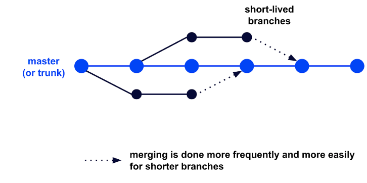


---
## Les commandes de bases (1/7)
- Créer une repository
```bash
git init
```
- Télécharger un repository distant en local
```
git clone <url du repo>
```
- Affichier l'état du repository local
```
git status
```
---
## Les commandes de bases (2/7)
- Ajouter un fichier ou un dossier dans le suivie de code
```
git add <nom du fichier> / <nom du dossier> / .
```
- Ajouter un commentaire aux changement
```
git commit -m "Mon message"
```
- Afficher les fichiers suvie
```
git ls-files
```
---
## Les commandes de bases (3/7)
- Afficher l'historique des changements
```
git log
```
```
git log --oneline
git log --oneline --revert
```


---
## Les commandes de bases (4/7)
- Afficher sa branche actuelle
```
git branch
```
- Afficher les branches disponibles
```
git branch -a
git branch -va
```
---
## Les commandes de bases (5/7)
- Créer une nouvelle branche local
```
git checkout -B <nom de la branche>
```
- Changer de branche
```
git switch <nom de la branch>
```
---
## Les commandes de bases (6/7)

- Importer les changements d'une branche à un autre
```
#branchB
git swich branchA
#branchA
git merge branchB
``` 
- Envoyer les changements sur le repository distant
```
git push
git push -u origin ma-branch
```
---
## Les commandes de bases (7/7)
- Récupérer les changements distant sans les appliquer
```
git fetch
```
- Récuperer les changements distant et les appliquer
```
git pull
```

---
## Commandes Additionnelles (1/2)

supprimer un fichier
```
git rm <file>
```
ne plus suivre un fichier
```
git rm --cache 
```
renommer un fichier
```
git mv
```
---
## Commandes Additionnelles (2/2)

Afficher les changements sur un fichier
```
git diff <file name>
```

---
## Git ignore
- Fichier `.gitignore`

- Indique a git les fichiers et/ou dossiers à ne pas prendre en considération

- [github.com/github/gitignore](https://github.com/github/gitignore) 


---
## Hands On (1/2)

1. Créer un dossier **DevOps** et en faire un repository GIT
2. Créer 2 branches **master** et **develop**
3. Créer un fichier README.md
4. Sur la branche **develop** créez 3 fichiers (file1, file2, file3)
5. Merge le contenu de **develop** dans **master**
6. renommer **file1** en **file1.txt**
7. supprimer **file3**

le fichier `README.md` contiendra l'ensemble des commandes

---
## Hands On (2/2)
1. Créer un compte Github
2. Créer un nouveau repository **vide**
3. Faire en sorte que le contenue du dossier **DevOps** soit dans se nouveau repository

le fichier `README.md` contiendra l'ensemble des commandes

---
# Gestion d'Infrastructure
</br>


<!-- _class: lead -->

---
# Vous avez 30 minutes


Qu'est ce que c'est?
A quoi ça sert? 
Comment ça fonctionne? 
<!-- _class: lead -->

---
## Qu'est ce que Terraform ? (1/2)
- Solution d'infrastructure as Code
- Développé en Go par Hashicorp
- Utilise le langage HCL (Hashicorp Configuratio Language)


---
## Qu'est ce que Terraform ? (2/2)
- Permet de mettre en place les bonnes pratiques du développement logiciel
  - Versionning
  - Test 
  - Packaging


---
## Comment fonctionne Terraform ?
- Description de l'infrastructure souhaitée dans fichier *.tf
  - une ressource = un bloque de code
- Comparaison de l'infra souhaitéé avec l'infra déployée
  - Utilisation de fichier d'état (state file)
- Utilisation d'une CLI pour visualiser / appliquer / détruire les changements / infra
  - Init / Plan / Apply / Destroy
- Communique avec les APIs du solution (Provider)

---


---

## Installation de Terrafrom

Windows (Chocolatey)
```
choco install terraform
```
Linux - Ubuntu
```
curl -s https://raw.githubusercontent.com/q-sw/my-tools/master/ubuntu_install_terraform.sh | sh
```
Mac OS
```
brew install terraform 
```

---
## La structure d'un projet Terraform


---
<h2> providers.tf </h2>

- Configuration de connexion à l'API du Cloud 


---
<h2> versions.tf </h2>

- Indique à Terraform quelles versions utiliser pour: 
  - Terraform
  - modules 
  - providers


---
<h2> backend.tf </h2>

- Fichier de configuration pour le stockage des states
- Si ce fichier n'existe pas le states seront local
- Différents backend existent
  - S3 
  - GCS 
  - secret kubernetes
  - PostgreSQL


---
<h2> main.tf </h2>

- Fichier de description des ressources.
 


---
<h2> variables.tf (1/4) </h2>

- Fichier de définition des variables du projet
```
variable "varibale name"{
  type = string|list()|map()|object()
  description = ""
  default = ""
}
```
---

<h2> variables.tf - Les types simple (2/4) </h2>


<table style="margin-left: auto; margin-right: auto;">
  <tr>
    <th style="background-color: rgb(69,90,99); color: white">Type</th>
    <th style="background-color: rgb(69,90,99); color: white">Description</th>
    <th style="background-color: rgb(69,90,99); color: white">exemple</th>
  </tr>
  <tr>
    <td>string</td>
    <td>chaine de caractères simple</td>
    <td><code>variable "name"{</br>
              &nbsp;type = string </br>
              &nbsp;description = "the user name" </br>
              &nbsp;default = "toto"
}</td>
  </tr>
  <tr>
    <td>number</td>
    <td>valeur numérique </td>
     <td><code>...</br>
     type = number<br>
     defaut = 2</td>
  </tr>
  <tr>
    <td>boolen</td>
    <td>Boolen, true ou false</td>
    <td><code>...</br>
     type = boolen<br>
     defaut = true</td>
  </tr>
</table>

---
<h2> variables.tf - Les types complexe (3/4) </h2>
<table style="margin-left: auto; margin-right: auto;">
  <tr>
    <th style="background-color: rgb(69,90,99); color: white">Type</th>
    <th style="background-color: rgb(69,90,99); color: white">Description</th>
    <th style="background-color: rgb(69,90,99); color: white">exemple</th>
  </tr>
  <tr>
    <td>list()</td>
    <td>Liste d'un autre type de variable</td>
     <td><code>list(string)</td>
  </tr>
  <tr>
    <td>map()</td>
    <td>ensemble de clé/valeur, non prédéfinie</td>
    <td><code>map()</td>
  </tr>
  <tr>
    <td>object()</td>
    <td>ensemble de clé/valeur, prédéfinie </td>
    <td>
    <code>
      object(</br>
      &nbsp;  {name: string, </br>
      &nbsp;  age: number}</br>
      ) 
    </code>
    </td>
  </tr>
</table>

---
<h2> variables.tf - La précédences (4/4) </h2>

- Manualy
- Default value
- Env var TF_VAR_[var name]
- terraform.tfvars file
- *.auto.tfvars file
- Command line -var or -var-file parameter

---

<h2> outputs.tf </h2>

- Permet d'afficher des informations des ressources créer
- `terraform output`
```
output "Mon output"{
  value = resource_type.resource_name.resource_object
}
```

---

## Les Fonctions builtin
|fonctions| descriptions|
|---------|-------------|
|count|Permet de réaliser une boucle sur une ressource|
|element|Permet de parcourir des element d'une liste|
|length|Permet de compter le nombre d'élément dans une liste|
|lookup|Permet dans un dictionnaire de récupérer la valeur d'un clé|

*[Documentation](https://developer.hashicorp.com/terraform/language/functions)*

---
## Les modules 

- Façon de packager des scripts Terraform
- Permet de réutiliser et de standardiser le déploiement d'une infrastructure
- Peut etre dans:
  - un dossier local
  - un repository Git

---
## Hands on (1/2)

- Créer dans la région Paris:
  - 1 VPC
  - 1 sous-réseau public
  - 2 sous-réseau privé
  - 1 security group autorisant le SSH
- Le script doit avoir en outpus
  - Le CIDR de chaque sous-réseau et son ID
  - ARN du security group

---
## Hands on (2/3)
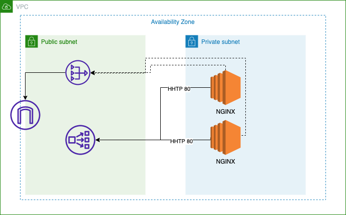
- Créer un module vous permettant de créer un VPC et des sous-reséaux.
  - Le module doit permettre de créer des sous-réseaux privé et public
- Créer 2 instance EC2 dans un sous-réseau privé créé par le module.
- Installer Nginx sur la VM
---
## Hands on (3/3)
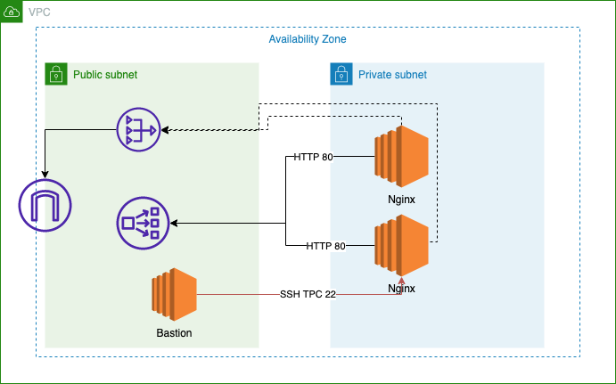
- A partir du script existant ajouter 1 Vm bastion acessible en SSH depuis internet uniquement depuis votre IP public
- Ajouter un security group aux VM Nginx permettant à la vm bastion de les contacter en SSH 

---
# Gestion de Configurations
</br>


<!-- _class: lead -->

---
# Vous avez 30 minutes


Qu'est ce que c'est?
A quoi ça sert? 
Comment ça fonctionne? 
<!-- _class: lead -->

---
## Qu'est ce qu'Ansible

- Gestionnaire de configuration écrit en Python
- Utilise SSH et WinRM pour communiquer avec le système
- Description de configuration en YAML
- Utilise un système d'inventaire

---
## Le YAML
- Fichier contenant des informations sous la forme clé-valeur
- Les informations peuvent etres de types:
  - string
  - list
  - map
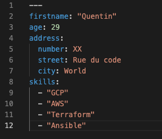
---
## Composant de bases d'Ansible 

- Inventaire (inventory)
- Modules
- Variables
- Playbooks
- Facts

---
## Structure d'un projet Ansible simple


[Documentation](https://docs.ansible.com/ansible/2.8/user_guide/playbooks_best_practices.html#directory-layout)

---
## Inventaire Ansibles (1/3)

- Fichier regroupant les informations des machines
- Les machines peuvent etre classé dans des groupes
  - un groupe par défaut = **all**
- 2 types d'inventaire existent:
  - Statique
  - Dynamique

---
## Inventaire Ansible Statique (2/3)

- 2 format pour décrire un inventaire
  - fichier INI / Plat
  - fichier YAML
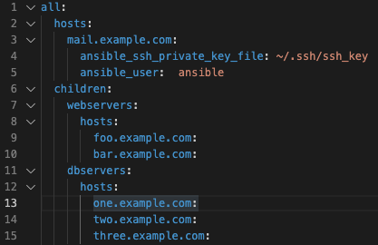  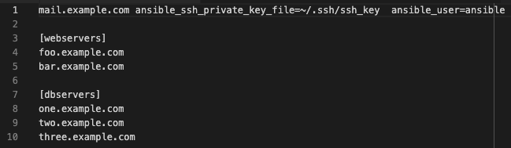 

[documentation](https://docs.ansible.com/ansible/latest/inventory_guide/intro_inventory.html)

---
## Inventaire Ansible Dynamique (3/3)

- Utilise un plugin  pour réaliser l'inventaire
- Se base sur les tags/ labels définie sur les instances.
- [Exemple pour EC2 sur AWS](https://docs.ansible.com/ansible/latest/collections/amazon/aws/aws_ec2_inventory.html)

---
## Modules (1/2)

- La création de tache se fait à l'aide de module
  - [module library](https://docs.ansible.com/ansible/2.9/modules/list_of_all_modules.html)
- Chaque module est décrit dans une page 
- Il est possible de développer ces propre modules avec Python

---
## Modules (2/2)

- Les modules de bases pour le système linux
  - yum / apt
  - systemd
  - user
  - copy
  - file
  - template

---
## Playbook Ansible
- Fichier regroupant un ensemble de "task"
- S'applique sur un host ou un groupe d'host de l'inventaire
- `ansible-playbook playbook.yml` permet d'executer le playbook

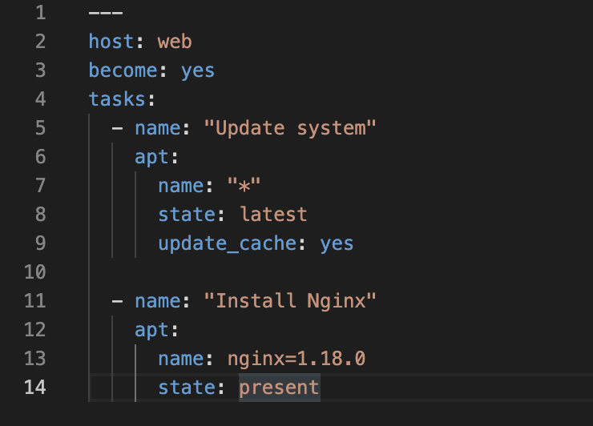

---
## Variables (1/2)
- Fichier YAML
- Appel aux variables dans les playbooks
```yaml
tasks:
  - name: "install {{package_name}}"
    apt:
      name: "{{package_name}}"
      state: present
```


---
## Variables (2/2)
- Plusieurs niveaux de Variables
  - variable par défaut d'un role (default/main.yaml)
  - variable d'inventarire groups_vars/all
  - variable inventaire du groupe
  - variable inventaire du host
  - variable venant des facts de hosts
  - variable de paramètre d'un role (vars/main.yaml)
  - variable passer avec la option -e

---
## Facts
- Informations relevées par Ansible pour chaque Host
- Afficher sous la forme d'un JSON
- toutes les variables de Facts sont préfixé par `ansible_*`
- peuvent-etre appeler dans un playbook sous la forme

```yaml
host_distrubution: {{ansible_facts['distribution']}}
```
[documentation](https://docs.ansible.com/ansible/latest/playbook_guide/playbooks_vars_facts.html)

---
## Playbooks Advances tips (1/6)

- Condition
```yaml
tasks:
  - name: Shut down CentOS 6 systems
    ansible.builtin.command: /sbin/shutdown -t now
    when:
      - ansible_facts['distribution'] == "CentOS"
      - ansible_facts['distribution_major_version'] == "6"
```
---
## Playbooks Advances tips (2/6)
- Loop over list
```yaml
- name: Add several users
  ansible.builtin.user:
    name: "{{ item }}"
    state: present
    groups: "wheel"
  loop:
     - testuser1
     - testuser2
```
---
## Playbooks Advances tips (3/6)
- Loop over dict
```yaml
- name: Using dict2items
  ansible.builtin.debug:
    msg: "{{ item.key }} - {{ item.value }}"
  loop: "{{ tag_data | dict2items }}"
  vars:
    tag_data:
      Environment: dev
      Application: payment
```

---
## Playbooks Advances tips (4/6)
- Loop over List of dict
```yaml
- name: Add several users
  ansible.builtin.user:
    name: "{{ item.name }}"
    state: present
    groups: "{{ item.groups }}"
  loop:
    - { name: 'testuser1', groups: 'wheel' }
    - { name: 'testuser2', groups: 'root' }
```
---
## Playbooks Advances tips (5/6)
- templating de fichier de fait à l'aide de JINJA 2 et du module template


---
## Playbooks Advances tips (6/6)
- error handling
```yaml
- name: Fail task when the command error output prints FAILED
  ansible.builtin.command: /usr/bin/example-command -x -y -z
  register: command_result
  failed_when: "'FAILED' in command_result.stderr"
```
- changed definition
```yaml
 - name: Report 'changed' when the return code is not equal to 2
    ansible.builtin.shell: /usr/bin/billybass --mode="take me to the river"
    register: bass_result
    changed_when: "bass_result.rc != 2"
```

---
## Roles Ansible
- C'est un ensemble de tasks réutilisable et paramètrable
- Herberge dans Github / Gitlab ou Ansible Galaxy
- Création d'un role
`ansible-galaxy init mon_role`
- Créer automatique l'ensemble 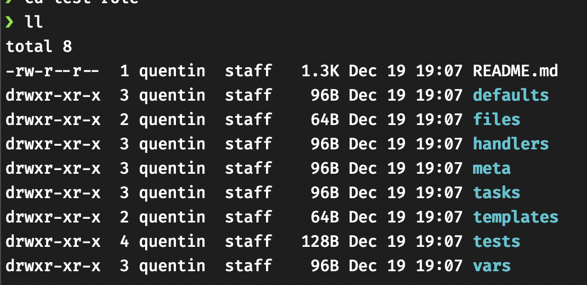
des dossiers et fichiers 

---
## Hands on
- Déployer avec l'aide de terraform 3 VMs dans un sous-réseau public
- 1 vm dans un groupe ansible load-balancer
- 2 vm dans un groupe server-web
- sur la VM load-balancer installez et configurez HAProxy pour qu'il load balance l'ensemble du traffic sur les serveurs web
- sur les vm server-web installez nginx et déployez sur chaque server un fichier index.html différent permettant d'indentifier sur quel serveur la requete est traité.

---
# Packaging
</br>

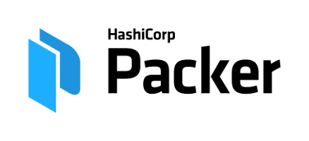
<!-- _class: lead -->

---
# Vous avez 30 minutes


Qu'est ce que c'est?
A quoi ça sert? 
Comment ça fonctionne? 
<!-- _class: lead -->

---
## Qu'est ce que Packer?

- Solution de packing d'image système multi-plateform
  - AWS/ Azure / GCP
  - VMWare / VirtualBox ...
[documentation](https://developer.hashicorp.com/packer/plugins)
- Permet de standardiser les déploiements système
- Utilise JSON ou HCL pour décrire la configuration
  [documentation](https://developer.hashicorp.com/packer/docs/templates)

---
## Les éléments de base d'un template

<table style="margin-left: auto; margin-right: auto;">
  <tr>
    <th style="background-color: rgb(69,90,99); color: white">Element</th>
    <th style="background-color: rgb(69,90,99); color: white">Description</th>
  </tr>
  <tr>
    <td>Builder/Plugin</td>
    <td>components of Packer that are able to create a machine image for a single platform</td>
  </tr>
  <tr>
  </tr>
  <tr>
    <td>build</td>
    <td>are a single task that eventually produces an image for a single platform</td>
  </tr>
  <tr>
    <td>Provisionner</td>
    <td> components of Packer that install and configure software within a running machine prior to that machine being turned into a static image</td>
  </tr>
</table>

---
## Hands on

- Créer une image standard ubuntu, incluant une stack LAMP de bases

---
# Packaging
</br>


<!-- _class: lead -->

---
# Vous avez 30 minutes


Qu'est ce que c'est?
A quoi ça sert? 
Comment ça fonctionne? 
<!-- _class: lead -->

---
## Qu'est ce qu'un container (1/2)

- Environnement d'éxcution isolé
- S'appuis des images système de bases
  - Ubunut / Debian / Alpine
- Contient l'ensemble des dépendances au bon fonctionnement de l'application
- Chaque container dispose d'un espace kernel "personnel"
  - espace kernel = namespaces système
  - un namespace est un regroupement de processus
  - un accès restreint aux ressources de l'hote = Cgroup

---
## Qu'est ce qu'un container (2/2)
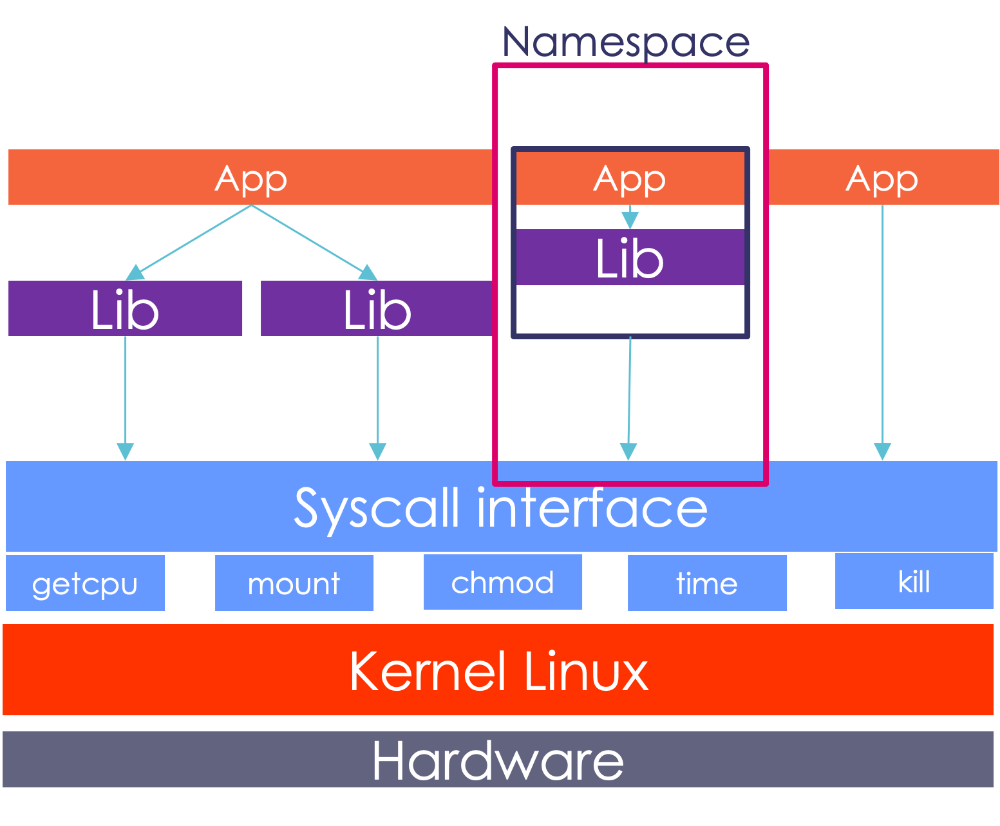

---
## Qu'est ce que Docker
- Solution de containerisation leader du marché
- Multi- plateform
- Met à disposition pour simplifier l'utilisation des containers: 
  - CLI (Command Line Interface)
  - Docker compose 
  - Docker Desktop
  - Docker Hub

---
## Comment ca fonctionne ? 
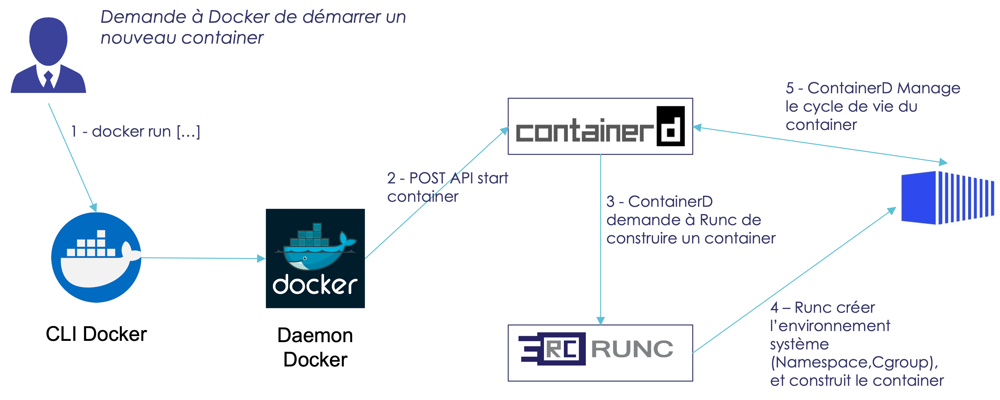

---
## Les commandes de base (1/2)
<table style="margin-left: auto; margin-right: auto;">
  <tr>
    <th style="background-color: rgb(69,90,99); color: white">Commandes</th>
    <th style="background-color: rgb(69,90,99); color: white">Description</th>
  </tr>
  <tr>
    <td>docker run</td>
    <td>construit et démarre un nouveau container</td>
  </tr>
  <tr>
    <td>docker start/stop/pause</td>
    <td>démarre, arrête ou met en pause un container.</td>
  </tr>
  <tr>
    <td>docker ps</td>
    <td>Liste les containers en cours d’execution</td>
  </tr>
  <tr>
    <td>docker logs</td>
    <td>affiche les logs d’un containers</td>
  </tr>
</table>

[documentation](https://docs.docker.com/engine/reference/commandline/docker/)

---
## Les commandes de base (2/2)

<table style="margin-left: auto; margin-right: auto;">
  <tr>
    <th style="background-color: rgb(69,90,99); color: white">Commandes</th>
    <th style="background-color: rgb(69,90,99); color: white">Description</th>
  </tr>
  <tr>
    <td>docker images</td>
    <td>listes les images disponible</td>
  </tr>
  <tr>
    <td>docker build</td>
    <td>construit une image à partir d’un dockerfile</td>
  </tr>
  <tr>
    <td>docker tag</td>
    <td>permet de tags une images</td>
  </tr>
  <tr>
    <td>docker rm</td>
    <td>supprime un container</td>
  </tr>
  <tr>
    <td>docker rmi</td>
    <td>supprime une images
</td>
  </tr>
</table>

[documentation](https://docs.docker.com/engine/reference/commandline/docker/)

---
## Construire son image avec Dockerfile
- Fichier décrivant étape par étape comment construire l'image
```Dockerfile
FROM alpine:3.14.2

RUN apk add --no-cache python3 py-pip
RUN mkdir /opt/blog_scrapper
WORKDIR /opt/blog_scrapper
COPY requirements.txt
RUN python3 -m pip install -r requirements.txt --no-cache
COPY scipt.py /opt/blog_scrapper/
COPY config.json /opt/blog_scrapper
CMD ["python3", "script.py"]
```
[documentation](https://docs.docker.com/engine/reference/builder/)

---
## Image docker un modèle en couche
- Chaque ligne du docker file est une couche
- Chaque couche dépend de la précédente
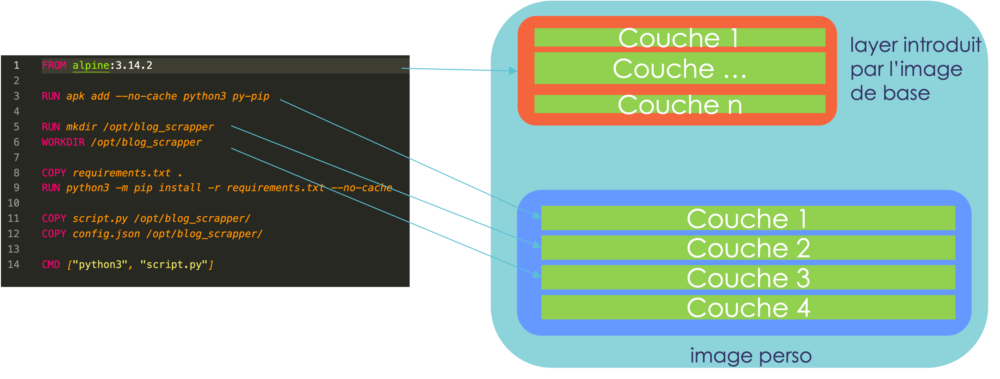

---
## Stocker ses images dans une registry
- Registry public 
  - DockerHub 
  - quay.io
  - gcr.io
- Registry privé
  - DockerHub
  - Harbor
  - JCR 

---
## Intéragrir avec une registry

<table style="margin-left: auto; margin-right: auto;">
  <tr>
    <th style="background-color: rgb(69,90,99); color: white">Commandes</th>
    <th style="background-color: rgb(69,90,99); color: white">Description</th>
  </tr>
  <tr>
    <td>docker login</td>
    <td>Se connecter à une registry</td>
  </tr>
  <tr>
    <td>docker push</td>
    <td>Upload une image dans une registry</td>
  </tr>
  <tr>
    <td>docker pull</td>
    <td>Télécharger une image d'une registry</td>
  </tr>
  <tr>
    <td>docker search</td>
    <td>chercher une image dans un registry</td>
  </tr>
  </tr>
</table>

[documentation](https://docs.docker.com/engine/reference/commandline/docker/)

---
## Hands on (1/2)
1) Développer le Dockerfile permettant d’afficher une page WEB
  - images de base nginx
  - héberger une page index.html personnelle
  - Démarrer le container et afficher la page
2)  Construire l’image
3)  Publier l’image sur le Docker hub ou une autre registry
---

## Hands on (2/2)
1) Développer un Dockerfile, permettant de construire une toolbox DevOps
2) la toolbox inclura les outils

|Tools|Tools|
|----|---|
|Terraform|Ansible|
|AWS CLI v2| Git|
|Github CLI | Checkov|

3) Publier l'image sur le Docker ou, sur AWS

---
# CI / CD


<!-- _class: lead -->

---
# Vous avez 30 minutes


<!-- _class: lead -->
---
## Qu'est ce que c'est?
- Systeme de CICD de Github.
- Permet l'execution de pipeline à l'aide d'action
- Une action peut etre existante et communautaire OU peut etre personnelle
- Une Pipeline / Workflows se décrit en YAML
- Les fichiers doivent se trouver à la racine du projet dans `.github/workflows`

---
## Construction d'une pipeline
- Une pipeline se déclenche: 
  - à la reception d'une évènement
  - manuellement
- Une pipeline est constitué de JOBS
- Un JOB est constitué de STEPS

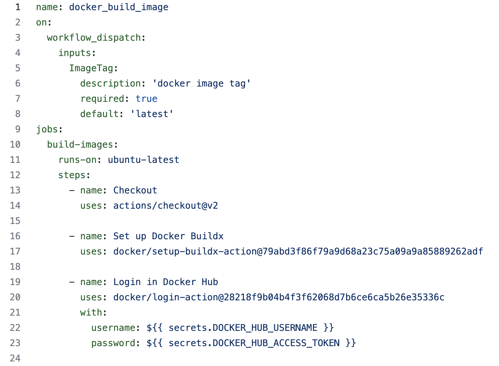

---
## Hands on

- Reprendre le dockerfile toolbox
- faire en sorte que github action build et publie l'image à chaque nouveau commit